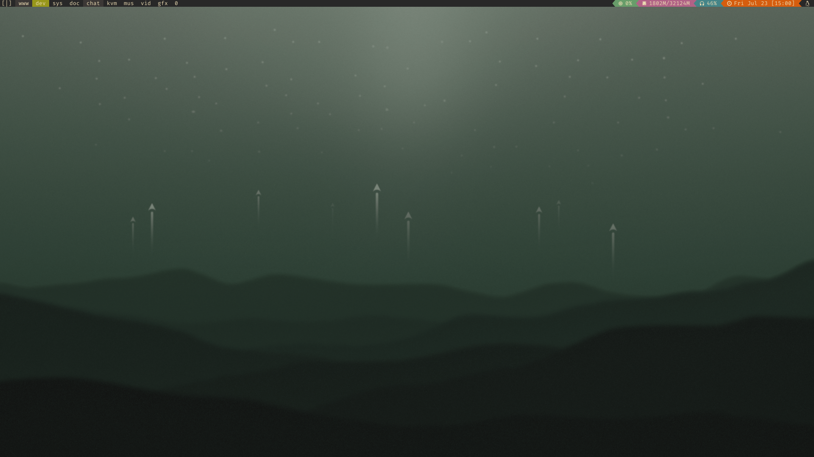

# dotfiles 

## Window Manager

- [Spectrwm](https://github.com/kuripa/dotfiles/tree/master/.config/spectrwm)
- [Dwm*]()

## Configs

- [Neovim](https://github.com/kuripa/dotfiles/tree/master/.config/nvim)
- [Dmenu*]()
- [Dmenu-scripts*]() 
- [Slock*]()
- [Alacritty](https://github.com/kuripa/dotfiles/tree/master/.config/alacritty)
- [Dunst](https://github.com/kuripa/dotfiles/tree/master/.config/dunst)
- [Starship](https://github.com/kuripa/dotfiles/tree/master/.config/starship)

**links to other repos of mine*

